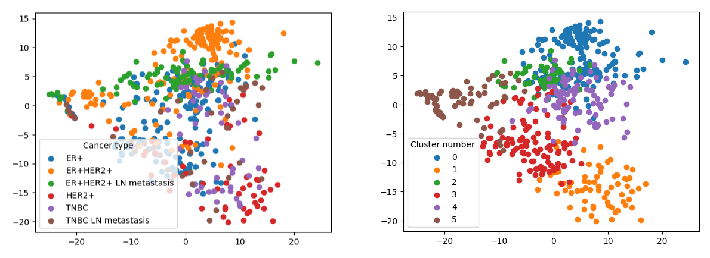
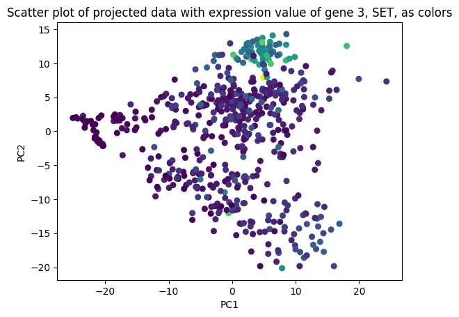

# Machine-Learning-for-Scientists-Group-Project
Record of our group project for the course Machine Learning for Scientists (02-620), Spring 2024.

### Introduction

In this project, we use breast cancer patient data from experiment GSE75688 to implement a possible method which can be used to identify the marker genes for subcancer types within a cancer type. We use a labelled dataset (dataset with information about the actual subtypes of breast cancer) to indicate the effectiveness of the k-means clustering on the data. In real scenarios, this information won't be available, but we show that the clustering results can be trusted to some extent as shown in our results (ARI score of 0.28). We identify important marker genes for a particular subtype of breast cancer (ER+HER2+) using our method, such as the gene SET, which is known to be a proto-oncogene.

### Instructions:

- Clone this repository
```
git clone https://github.com/shashkat/Machine-Learning-for-Scientists-Group-Project.git
```

- Go to the directory of the project and run the file located in: **src/complete_project_4_methods.ipynb**

- Sections in the file:
    - **Downloading data**: download breast cancer data from experiment GSE75688.
    - **Data Preprocessing and Saving**: preprocess the data and get gene expression matrix and label info in form of numpy arrays.
    - **Perform PCA**: perform dimensionality reduction using PCA to visualize the clusters in the data.
    - **Perform K-means**: perform clustering on the data to get our own labels (unsupervised learning)
    - **Feature Identification using Logistic Regression**: use logistic regression model on the data to select the features (genes) of high importance.
    - **Feature Identification using Random Forest**: use random forest model on the data to select the features (genes) of high importance.

### Results

Visual comparison of the actual labels vs the clustering we found to indicate how good k-means is in determining the subclusters in the data (hence can be used even when there are no real labels present).



Visual representation of the differential expression of the SET (a known proto-oncogene) gene in the subtype of breast cancer, which closely follows the ER+HER2+ cluster in the actual clustering.



<!-- ### OPTIONAL - Alternate instructions (to get and load GSE75688 RNA-seq dataset):

Download data:
```
$ python3 src/download_data.py
```

Preprocess data:
```
$ python3 src/data_preprocessing.py
```
Features `X.npy` and labels `y.npy` will be saved to `data/preprocessed/` dir. 

You can load X and y by:
```
X = np.load('../data/processed/X.npy')
y = np.load('../data/processed/y.npy', allow_pickle=True)
```

To run PCA:
```
$ python3 src/PCA.py
``` -->

### References- 

- https://scikit-learn.org/stable/modules/generated/sklearn.metrics.adjusted_rand_score.html
- https://www.ncbi.nlm.nih.gov/gene/6418
- https://www.keboola.com/blog/pca-machine-learning
- https://www.analyticsvidhya.com/blog/2019/08/comprehensive-guide-k-means-clustering/

